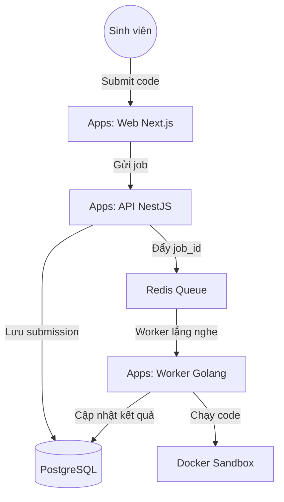

# TrueSubmit 🚀

**TrueSubmit** là hệ thống Online Judge nội bộ dành cho sinh viên, cung cấp môi trường rèn luyện thuật toán, chấm bài tự động với kiến trúc hiện đại, an toàn và hiệu năng cao.

## 🎯 Mục tiêu & Yêu cầu hiệu năng

Hệ thống được thiết kế nhằm giải quyết bài toán thực tế khi **có 1000 sinh viên cùng chấm bài đồng thời trong 1 giờ thi cao điểm**, đảm bảo các tiêu chí cốt lõi:
- ⚡ **Tốc độ biên dịch (Compile) cực nhanh**: Tối ưu hóa thời gian khởi tạo sandbox để biên dịch code của sinh viên ngay lập tức.
- 🔄 **Tốc độ phản hồi (Response) tức thời**: Phản hồi kết quả chấm bài gần như ngay lập tức (real-time feedback) nhờ hệ thống hàng đợi phân tán hoạt động hiệu quả.

---

## 🏗️ Kiến trúc Hệ thống (Monorepo)

Dự án sử dụng **Turborepo** để quản lý mã nguồn, đảm bảo tính đồng bộ giữa các thành phần.



---

## 🛠️ Tech Stack

### 💻 Frontend & API (Web Layer)
- **Framework**: Next.js 16.2 (App Router)
- **Backend API**: NestJS (TypeScript)
- **Database**: PostgreSQL kết hợp Drizzle ORM
- **UI**: TailwindCSS & Shadcn/UI

### ⚙️ Execution Engine (Worker Layer)
- **Language**: Golang (Tối ưu xử lý tiểu trình và Docker)
- **Task Queue**: Redis kết hợp BullMQ
- **Sandbox**: Docker Engine API (Cô lập môi trường chạy code)

---

## 🚀 Tính năng nổi bật

- 🌐 **Đa ngôn ngữ**: Hỗ trợ C/C++, C#, Go, Java, Python với khả năng tùy chỉnh version thông qua Docker Images.
- 🔒 **Bảo mật tuyệt đối**: Code người dùng được thực thi trong các container riêng biệt, giới hạn tài nguyên (CPU/RAM) và thời gian thực thi (Time Limit).
- ⚡ **Trải nghiệm mượt mà**: Giao diện hiện đại, bảng xếp hạng cập nhật realtime.
- 📦 **Khả năng mở rộng**: Cấu trúc Monorepo dễ dàng bảo trì và bổ sung tính năng mới.

---

## ⚙️ Hướng dẫn cài đặt

### 📋 Yêu cầu hệ thống
- **Node.js** (v20+)
- **pnpm**
- **Docker**
- **Redis**

### 🚀 Các bước khởi chạy

1. **Clone dự án:**
   ```bash
   git clone <url-repo-của-bạn>
   cd truesubmit
   ```

2. **Cài đặt dependencies:**
   ```bash
   pnpm install
   ```

3. **Cấu hình môi trường:**
   Sao chép file `.env.example` thành `.env` trong các thư mục `apps/api` và `apps/web` rồi điền thông số kết nối DB/Redis.

4. **Khởi chạy môi trường dev:**
   ```bash
   turbo run dev
   ```
