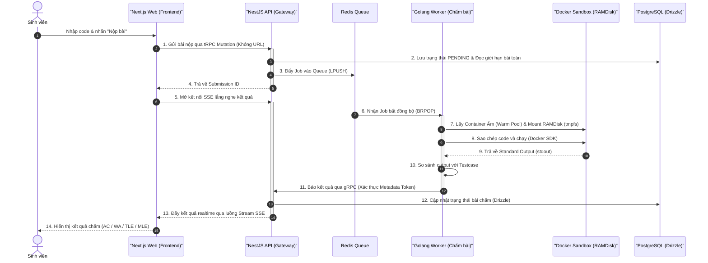

# TrueSubmit 

**TrueSubmit** là hệ thống chấm bài trực tuyến (Online Judge) hiệu năng cao, được thiết kế chuyên biệt để tổ chức các kỳ thi lập trình quy mô lớn với tốc độ chấm bài siêu tốc và tính bảo mật tuyệt đối.

---

### **Hạ tầng & Hệ thống (System Tech Stack)**
<p align="left">
  <a href="https://skillicons.dev">
    
  </a>
</p>

### **Ngôn ngữ hỗ trợ chấm (Supported Languages)**
<p align="left">
  <a href="https://skillicons.dev">
    
  </a>
</p>

---

##  1. Mục Tiêu Dự Án & Chỉ Số Hiệu Năng

Hệ thống được thiết kế để giải quyết triệt để bài toán **1000 sinh viên nộp bài đồng thời trong cùng 1 giờ thi** dưới các ràng buộc kỹ thuật khắt khe:
* **Thời gian phản hồi sub-50ms**: Tối ưu hóa tối đa thời gian từ lúc nhận bài cho tới khi khởi chạy sandbox.
* **Cô lập hoàn toàn (Sandbox Isolation)**: Không cho phép mã nguồn sinh viên truy cập mạng internet (`--network none`) hoặc tài nguyên hệ thống vật lý máy chủ.
* **Cấu hình giới hạn cứng**: Giới hạn CPU, RAM (Cgroups) và số lượng luồng (PID limits chống Fork Bomb) được tinh chỉnh động cho từng bài thi.
* **Real-time instant feedback**: Trả điểm ngay lập tức về giao diện trình duyệt mà không cần tải lại trang.

---

##  2. Phân Định Vai Trò Phát Triển (Human-AI Collaboration)

Dự án này tuân thủ nguyên tắc thiết kế hệ thống nghiêm ngặt:
* **Thiết kế Hệ thống & Kiến trúc (100% Con Người)**: Toàn bộ cấu trúc giao tiếp không dùng REST API (kết hợp **tRPC**, **gRPC**, **Redis Queue**, **SSE**), sơ đồ thực thể cơ sở dữ liệu (PostgreSQL Schema), giải pháp Docker Warm Pool & RAMDisk đều được lên ý tưởng và thiết kế hoàn toàn bởi kỹ sư con người.
* **Xây dựng & Triển khai (Hỗ trợ bởi AI)**: AI được sử dụng làm trợ lý đắc lực để tạo sinh mã nguồn boilerplate, viết tài liệu kỹ thuật, chuyển đổi interface Protobuf sang cấu trúc code của NestJS/Golang và tối ưu các đoạn mã kiểm thử.

---

##  3. Sơ đồ Kiến trúc & Luồng Dữ liệu (Workflow)



---

##  4. Công Nghệ Sử Dụng (Tech Stack)

### Frontend Layer (`apps/web`)
* **Next.js 16** (App Router) giao tiếp tRPC Client.
* TailwindCSS & shadcn/ui phục vụ giao diện responsive, hiện đại.
* SSE Stream Client để nhận dữ liệu chấm điểm thời gian thực.

### API Gateway Layer (`apps/api`)
* **NestJS** đóng vai trò vừa là tRPC Server vừa là gRPC Server (cổng 50051).
* **Drizzle ORM** tương tác hiệu năng cao với PostgreSQL.
* Động cơ sinh sự kiện Server-Sent Events (SSE) đẩy điểm nhanh chóng.

### Engine Layer (`apps/worker`)
* **Golang Microservice** tối ưu hiệu suất đọc queue, quản lý luồng Docker SDK song song.
* **Warm Pool Manager** tái sử dụng các container ấm (GCC, Python, OpenJDK).
* Trình kết nối gRPC Client bảo mật qua `APP_INTERNAL_AUTH_TOKEN`.

---

##  5. Cấu Trúc Monorepo (`truesubmit`)

```text
truesubmit/
├── apps/
│   ├── web/                 # Next.js Application (Port 3000)
│   ├── api/                 # NestJS API Gateway & gRPC/tRPC Server (Port 3001, gRPC Port 50051)
│   └── worker/              # Golang Worker (Chạy daemon chấm bài với Docker SDK)
├── docs/                    # Tài liệu kiến trúc hệ thống
│   ├── api/                 # Chi tiết thiết kế Backend API
│   ├── web/                 # Chi tiết thiết kế Frontend Web
│   ├── worker/              # Chi tiết thiết kế Sandbox & Worker
│   └── overview.md          # Tài liệu tổng quan kiến trúc hệ thống
└── package.json             # Cấu hình workspace Monorepo npm
```

---

##  6. Hướng Dẫn Khởi Chạy Nhanh (Quick Start)

Quy trình chuẩn bị cơ sở dữ liệu, chạy Drizzle Kit migration và khởi động toàn bộ ứng dụng được trình bày chi tiết trong tài liệu tổng quan tại **[Tài liệu hướng dẫn tổng quan (overview.md)](file:///v:/Hybrid/truesubmit/docs/overview.md)**.