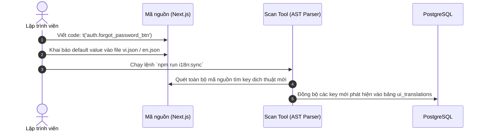
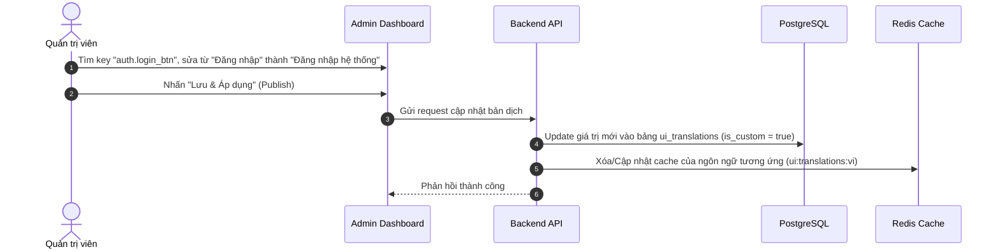
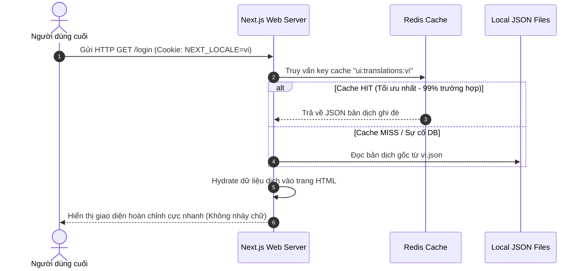

# 🌐 Tài Liệu Thiết Kế Kiến Trúc: Dịch Thuật Động Tại Runtime (Runtime UI & Content Translations)

Tài liệu này đặc tả thiết kế kiến trúc cho phép quản trị viên cấu hình, chỉnh sửa toàn bộ ngôn ngữ giao diện (Chữ tĩnh) và dữ liệu nghiệp vụ (Chữ động) của hệ thống TrueSubmit tại runtime thông qua Admin Panel mà không cần thay đổi mã nguồn hay biên dịch lại hệ thống.

---

## 1. Mục Tiêu (Objectives)

- **Quản trị độc lập (Zero-code Localization)**: Admin/Biên dịch viên có toàn quyền tùy biến, chỉnh sửa tất cả chữ hiển thị trên giao diện (như nhãn nút bấm, tiêu đề, thông báo lỗi) và dịch nội dung nghiệp vụ (đề bài, kỳ thi, CMS) trực tiếp từ giao diện Admin.
- **Tối ưu hóa hiệu năng (Core Web Vitals)**: Đảm bảo thời gian phản hồi trang (TTFB) và tốc độ tải giao diện cực nhanh. Không tạo thêm độ trễ do truy vấn cơ sở dữ liệu (PostgreSQL) khi render trang.
- **Tránh Hydration Mismatch**: Đồng bộ hóa dữ liệu ngôn ngữ mượt mà giữa Server-Side Rendering (SSR) và Client-Side Hydration, loại bỏ hoàn toàn hiện tượng nháy chữ hoặc lệch bố cục giao diện.
- **Bảo toàn Fallback (Robust Fallback)**: Nếu hệ thống chưa có bản dịch động hoặc cơ sở dữ liệu gặp sự cố, ứng dụng tự động sử dụng tệp ngôn ngữ mặc định được đóng gói sẵn trong mã nguồn.

---

## 2. Giải Pháp Tối Ưu (Optimal Solution)

Để kết hợp hoàn hảo giữa tính linh hoạt của Database và tốc độ của File tĩnh, hệ thống áp dụng kiến trúc **Hybrid Storage & Caching Layer**:

```mermaid
graph TD
    subgraph Client Layer
        Browser[Trình duyệt Người dùng]
    end

    subgraph Server Layer (Next.js SSR / Go API)
        NextServer[Next.js SSR Engine]
        Redis[Redis Cache / Memory Store]
    end

    subgraph Storage Layer
        Postgres[(PostgreSQL Database)]
        LocalFiles[Local JSON Translation Files]
    end

    Browser -->|"1. Gửi request + Locale Cookie"| NextServer
    NextServer -->|"2. Đọc Cache"| Redis
    Redis -->|"3. Cache Hit: Trả về JSON"| NextServer
    NextServer -->|"4. SSR Giao diện hoàn chỉnh"| Browser

    %% Cache Miss Flow
    NextServer -.->|"2b. Cache Miss"| Postgres
    Postgres -.->|"Trả về dữ liệu dịch"| NextServer
    NextServer -.->|"Cập nhật Cache"| Redis

    %% Fallback Flow
    NextServer -.->|"3b. Fallback nếu DB trống"| LocalFiles
```

### 2.1. Phân Cấp Dữ Liệu Dịch Thuật
1. **Tầng 1 - Local JSON (Mặc định)**: Đóng gói cùng mã nguồn dự án. Chứa các bản dịch cơ sở của lập trình viên khi phát triển tính năng.
2. **Tầng 2 - Database (Ghi đè)**: Lưu trữ trong bảng `ui_translations`. Nếu có bản dịch do Admin tự định nghĩa trong Database, bản dịch này sẽ ghi đè giá trị của Tầng 1.
3. **Tầng 3 - Caching Layer (Hiệu năng)**: Khi khởi động ứng dụng hoặc khi Admin bấm nút **"Publish"**, toàn bộ bản dịch trong Database được gộp thành một JSON object lớn và nạp vào Redis (hoặc Memory Cache của Server). Next.js SSR chỉ đọc dữ liệu từ cache này.

### 2.2. Thiết Kế Cơ Sở Dữ Liệu (Database Schema)

#### 1. Cấu hình Ngôn ngữ & Múi giờ của Người dùng (`user_profiles`)
```typescript
import { pgTable, uuid, varchar } from 'drizzle-orm/pg-core';
import { uuidv7 } from 'uuidv7';
import { users } from './users';

export const userProfiles = pgTable('user_profiles', {
  id: uuid('id').primaryKey().$defaultFn(() => uuidv7()),
  userId: uuid('user_id').references(() => users.id).notNull(),
  
  // Ngôn ngữ và Múi giờ cá nhân hóa của người dùng
  preferredLanguage: varchar('preferred_language', { length: 10 }).default('vi').notNull(),
  timezone: varchar('timezone', { length: 100 }).default('Asia/Ho_Chi_Minh').notNull(),
});
```

#### 2. Cấu hình Bản địa hóa Hệ thống (`system_settings`)
```typescript
// Cấu hình con cho từng ngôn ngữ được hỗ trợ
export interface LanguageSetting {
  lang: string;      // Mã ngôn ngữ (e.g., 'vi', 'en')
  order: number;     // Thứ tự sắp xếp hiển thị trên dropdown
  isEnabled: boolean; // Trạng thái bật/tắt (cho phép/không cho phép dùng ngôn ngữ này)
}

// Cấu hình tổng thể hệ thống lưu trong system_settings (key: 'localization')
export interface SystemLocalizationConfig {
  defaultLanguage: string;      // Ngôn ngữ mặc định
  defaultTimezone: string;      // Múi giờ mặc định
  languages: LanguageSetting[]; // Danh sách các ngôn ngữ có cấu hình chi tiết (thứ tự & trạng thái)
}
```

#### 3. Bảng Dịch thuật Giao diện (`ui_translations`)
```typescript
import { pgTable, uuid, varchar, text, boolean, timestamp } from 'drizzle-orm/pg-core';
import { uuidv7 } from 'uuidv7';

export const uiTranslations = pgTable('ui_translations', {
  id: uuid('id').primaryKey().$defaultFn(() => uuidv7()),
  
  // Khóa phân cấp bằng dấu chấm. Ví dụ: 'auth.login_btn', 'common.submit_btn'
  keyTranslation: varchar('key_translation', { length: 255 }).notNull(),
  
  // Mã ISO 639-1 (e.g. 'vi', 'en', 'ja')
  languageCode: varchar('language_code', { length: 10 }).notNull(),
  
  // Giá trị hiển thị tùy chỉnh
  val: text('val').notNull(),
  
  // Đánh dấu bản dịch do admin chỉnh sửa (để phân biệt với bản dịch mặc định)
  isCustom: boolean('is_custom').default(false).notNull(),
  
  updatedAt: timestamp('updated_at').defaultNow().notNull(),
});
```

---

## 3. Luồng Công Việc (Workflows)

### Luồng A: Nhà Phát Triển Thêm Tính Năng Mới (Developer Workflow)


### Luồng B: Quản Trị Viên Chỉnh Sửa Bản Dịch (Admin Customization Workflow)


### Luồng C: Người Dùng Truy Cập Trang Web (End-user Flow)

