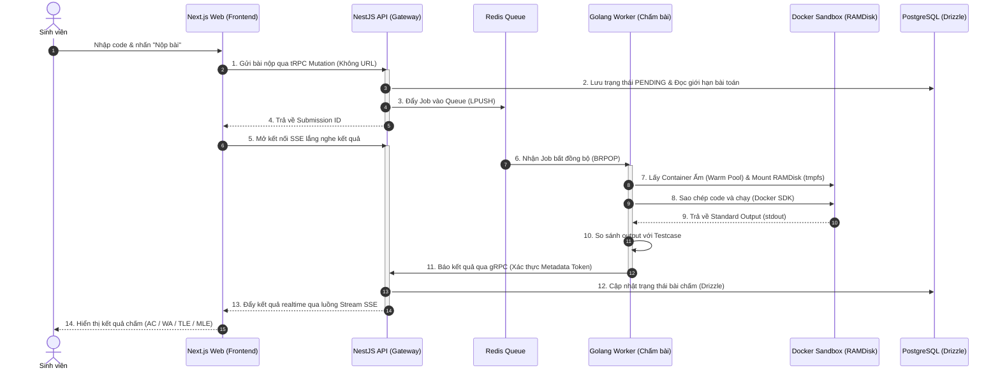
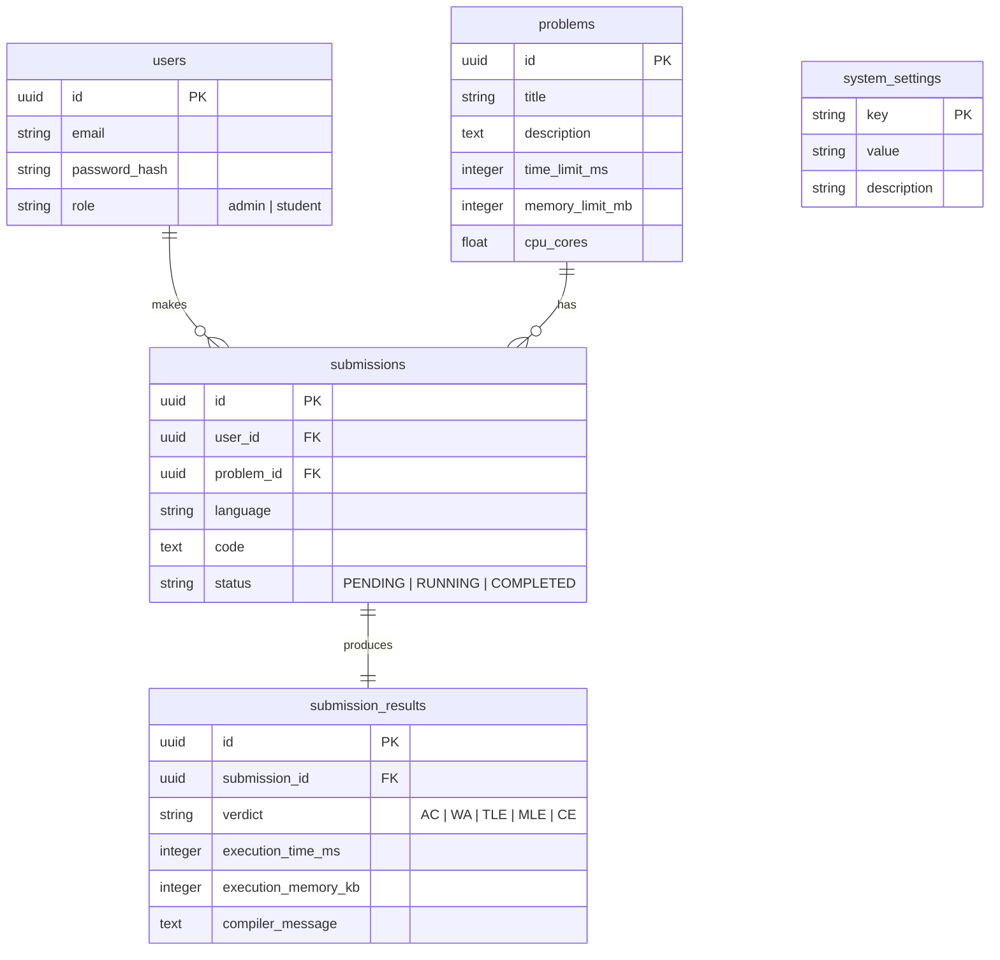

# TrueSubmit - Tổng Quan Kiến Trúc Hệ Thống 🚀

TrueSubmit là hệ thống chấm bài trực tuyến (Online Judge) hiệu năng cao, được thiết kế để giải quyết bài toán **1000 sinh viên nộp bài đồng thời trong 1 giờ thi** với tốc độ biên dịch cực nhanh (sub-50ms) và phản hồi kết quả tức thời.

Để loại bỏ hoàn toàn sự phức tạp của việc định nghĩa URL truyền thống (REST API) và tăng tốc độ truyền tải dữ liệu, hệ thống sử dụng các công nghệ tiên tiến nhất năm 2026: **tRPC**, **gRPC**, **Redis Queue**, và **Server-Sent Events (SSE)**.

---

## 🏗️ Sơ đồ Kiến trúc & Luồng Dữ liệu (Workflow)



---

## ⚡ 4 Trụ Cột Giao Tiếp Hiện Đại (Không Sử Dụng REST Endpoint)

### 1. tRPC (Giao tiếp Frontend $\leftrightarrow$ Backend)
* **Mục đích**: Loại bỏ hoàn toàn việc định nghĩa URL, HTTP Methods, và viết API Callers thủ công ở phía Client.
* **Chi tiết kỹ thuật**:
  - **Backend (NestJS Router Definition)**:
    ```typescript
    // apps/api/src/trpc/routers/submission.router.ts
    import { router, publicProcedure } from '../trpc';
    import { z } from 'zod';

    export const submissionRouter = router({
      submit: publicProcedure
        .input(z.object({
          problemId: z.string().uuid(),
          code: z.string().min(1),
          language: z.enum(['cpp', 'java', 'python', 'go'])
        }))
        .mutation(async ({ input, ctx }) => {
          const submission = await ctx.db.insert(submissions).values({
            userId: ctx.user.id,
            problemId: input.problemId,
            code: input.code,
            language: input.language,
            status: 'PENDING'
          }).returning();

          // Truy vấn cấu hình tài nguyên của bài toán
          const problem = await ctx.db.query.problems.findFirst({
            where: eq(problems.id, input.problemId)
          });

          // Đẩy vào Redis Queue bất đồng bộ
          await ctx.redis.lpush('submission_queue', JSON.stringify({
            submissionId: submission[0].id,
            code: input.code,
            language: input.language,
            timeLimitMs: problem.timeLimitMs,
            memoryLimitMb: problem.memoryLimitMb,
            cpuCores: problem.cpuCores
          }));

          return { submissionId: submission[0].id };
        })
    });
    ```
  - **Frontend (Next.js Call)**:
    ```typescript
    // apps/web/app/problems/[id]/workspace.tsx
    import { trpc } from '@/lib/trpc';

    const { mutateAsync: submitCode, isLoading } = trpc.submission.submit.useMutation();

    const handleSubmit = async () => {
      const result = await submitCode({
        problemId: 'uuid-1234',
        code: '// mã nguồn của học sinh...',
        language: 'cpp'
      });
      // Kết quả type-safe, autocomplete thuộc tính 'submissionId'
      console.log('Submission Created:', result.submissionId);
    };
    ```

### 2. Redis Queue (Giảm chấn tải cao)
* **Mục đích**: Bộ đệm trung gian lưu trữ các Job chấm bài để Worker xử lý tuần tự/song song theo tài nguyên cho phép, bảo vệ Go Worker không bị sập vì tạo quá nhiều Docker Sandbox cùng lúc.
* **Chi tiết cấu trúc Payload (Job Format)**:
  Mỗi Job được đẩy lên hàng đợi `submission_queue` dưới dạng chuỗi JSON có cấu trúc như sau:
  ```json
  {
    "submissionId": "f789d98e-4a6c-48d9-952b-87d3a01bf280",
    "code": "#include <iostream>\nusing namespace std;\nint main() { cout << \"Hello World\"; return 0; }",
    "language": "cpp",
    "timeLimitMs": 1000,
    "memoryLimitMb": 256,
    "cpuCores": 0.5
  }
  ```

### 3. gRPC (Giao tiếp Worker $\rightarrow$ Backend)
* **Mục đích**: Truyền tải kết quả chấm từ Golang Worker về NestJS API với độ trễ cực thấp, tiết kiệm băng thông và đảm bảo an toàn tuyệt đối thông qua gRPC Metadata.
* **Chi tiết Protobuf Contract (`submission.proto`)**:
  ```protobuf
  syntax = "proto3";

  package truesubmit.v1;

  option go_package = "apps/worker/grpc/v1;v1";

  service SubmissionResultService {
    rpc ReportResult (ReportResultRequest) returns (ReportResultResponse);
  }

  message ReportResultRequest {
    string submission_id = 1;
    string verdict = 2;              // AC (Accepted), WA (Wrong Answer), TLE, MLE, CE
    int32 execution_time_ms = 3;
    int32 execution_memory_kb = 4;
    string compiler_message = 5;      // Thông tin chi tiết lỗi biên dịch nếu có
  }

  message ReportResultResponse {
    bool success = 1;
  }
  ```
* **Chi tiết mã hóa Golang Client & Metadata Auth**:
  ```go
  // apps/worker/judge/reporter.go
  package judge

  import (
      "context"
      "google.golang.org/grpc"
      "google.golang.org/grpc/metadata"
      pb "apps/worker/grpc/v1"
  )

  func ReportToBackend(grpcServerAddr string, token string, req *pb.ReportResultRequest) error {
      conn, _ := grpc.Dial(grpcServerAddr, grpc.WithInsecure())
      defer conn.Close()
      client := pb.NewSubmissionResultServiceClient(conn)

      // Ký token xác thực nội bộ vào gRPC Metadata
      ctx := metadata.AppendToOutgoingContext(context.Background(), "authorization", token)
      
      _, err := client.ReportResult(ctx, req)
      return err
  }
  ```

### 4. Server-Sent Events - SSE (Real-time Stream đẩy điểm)
* **Mục đích**: Thay vì Client gửi hàng nghìn request kéo thông tin liên tục (Polling), Server sẽ giữ kết nối và đẩy trạng thái cập nhật xuống cho Client ngay khi có sự thay đổi.
* **Chi tiết định dạng Raw Event-Stream**:
  Khi client Next.js kết nối đến `/api/submissions/:id/sse`, NestJS sẽ mở một Stream HTTP dạng `text/event-stream` và đẩy dữ liệu:
  ```http
  HTTP/1.1 200 OK
  Content-Type: text/event-stream
  Cache-Control: no-cache
  Connection: keep-alive

  event: status-change
  data: {"status": "RUNNING"}

  event: status-change
  data: {"status": "COMPLETED", "verdict": "AC", "time": 45, "memory": 2048}
  ```

---

## 🔒 Cơ chế Sandbox của Worker
Để bảo đảm mã nguồn của sinh viên không gây nguy hiểm hoặc ảnh hưởng đến máy chủ vật lý:
1. **Docker Container Isolation**: Chạy mỗi bài biên dịch bên trong một container Docker được cấu hình `--network none` (hoàn toàn ngắt kết nối Internet để tránh sinh viên viết code spam request ra ngoài).
2. **Warm Pool (Tối ưu <50ms)**: Worker giữ sẵn các container biên dịch (GCC, Python, Go) ở chế độ ngủ (Idle), sao chép code vào chạy trực tiếp và dọn dẹp sạch sẽ sau khi dùng xong, thay vì khởi tạo container mới từ đầu.
3. **RAMDisk (Tmpfs Mount)**: Mount thư mục làm việc của Container trực tiếp trên bộ nhớ RAM vật lý để loại bỏ nghẽn I/O ổ cứng và tăng tốc độ biên dịch tối đa.
4. **Cgroups Limits**: Áp đặt giới hạn RAM (`256MB`), CPU (`0.5 Cores`) và PIDs limit (`20` - chống Fork Bomb) được cấu hình động theo từng đề bài.

---

## 🗄️ 5. Thiết Kế Cơ Sở Dữ Liệu (Database Schema)

Hệ thống sử dụng Drizzle ORM kết hợp PostgreSQL để quản lý các bảng cốt lõi. Để đảm bảo tính mở rộng và dễ bảo trì, thay vì dồn tất cả các bảng vào một file đơn lẻ, toàn bộ schema được tách nhỏ thành các module riêng biệt trong thư mục `apps/api/src/database/schemas/` (bao gồm `users.schema.ts`, `problems.schema.ts`, `submissions.schema.ts`, `submission-results.schema.ts`, `system-settings.schema.ts`) và được re-export tập trung qua `index.ts`:



### ⚙️ Cấu hình động cho Admin (Dynamic Settings)
Admin cấp cao nhất có thể thay đổi các cấu hình hệ thống trực tiếp thông qua giao diện Web. Các tham số này được lưu trong bảng `system_settings`:
* **`SANDBOX_MAX_CONCURRENT`**: Số lượng sandbox chạy song song tối đa trên mỗi Worker (Mặc định: `8`).
* **`SANDBOX_TIMEOUT_SECONDS`**: Thời gian tối đa cho một phiên chấm bài (Mặc định: `5s`).
* **`SANDBOX_MEMORY_MB`**: Giới hạn RAM tối đa cho container (Mặc định: `256MB`).
* **`SANDBOX_CPU_CORES`**: Giới hạn CPU Cores cho container (Mặc định: `0.5`).

---

## 📂 6. Cấu Trúc Monorepo (`truesubmit`)

```text
truesubmit/
├── apps/
│   ├── web/                 # Next.js Application (Port 3000)
│   ├── api/                 # NestJS API Gateway & gRPC/tRPC Server (Port 3001, gRPC Port 50051)
│   └── worker/              # Golang Worker (Chạy daemon chấm bài với Docker SDK)
├── docs/                    # Tài liệu kiến trúc hệ thống
│   ├── api/
│   ├── web/
│   ├── worker/
│   └── overview.md          # Tài liệu tổng quan (File này)
└── package.json             # Cấu hình workspace Monorepo npm
```

---

## 🚀 7. Hướng Dẫn Khởi Chạy Nhanh (Quick Start)

### Bước 1: Khởi động Cơ sở dữ liệu và Redis
Chạy Docker Compose để khởi chạy PostgreSQL và Redis:
```bash
docker compose up -d
```

### Bước 2: Thiết lập Database Schema & Migrations
Di chuyển vào thư mục `apps/api` và chạy lệnh Drizzle:
```bash
cd apps/api
npm install
npx drizzle-kit push
```

### Bước 3: Khởi chạy 3 ứng dụng đồng thời

1. **Khởi chạy NestJS API Gateway**:
   ```bash
   cd apps/api
   npm run dev
   # Server lắng nghe tRPC tại cổng 3001 và gRPC tại cổng 50051
   ```

2. **Khởi chạy Next.js Frontend**:
   ```bash
   cd apps/web
   npm run dev
   # Truy cập ứng dụng tại http://localhost:3000
   ```

3. **Khởi chạy Golang Worker**:
   ```bash
   cd apps/worker
   go run main.go
   # Worker kết nối đến Redis Queue và sẵn sàng gọi gRPC trả kết quả
   ```
