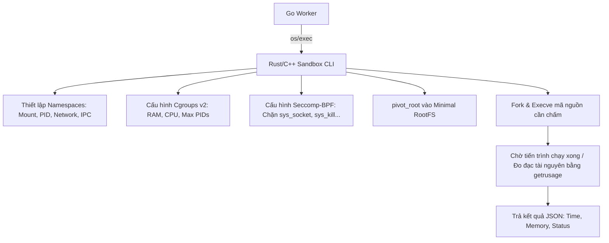

# Kiến trúc Sandbox Chuyên dụng (Rust/C++) & WebAssembly (Wasm) Runtime

Tài liệu này chi tiết hóa cách thiết kế, hoạt động và tích hợp hai cơ chế cô lập mã nguồn hiệu năng cao thay thế cho Docker thông thường:
1. **Linux-native Sandbox (Rust/C++)**: Tối ưu hóa sâu hệ thống Linux (Namespaces, Cgroups, Seccomp-BPF) để chấm bài nhanh kỷ lục.
2. **WebAssembly (Wasm) Runtime**: Chạy in-process trên mọi hệ điều hành với độ trễ micro-giây sử dụng công nghệ Wasmtime/Wasmer.

---

## 🏗️ PHẦN 1: Thay thế Docker bằng Sandbox chuyên dụng (Rust/C++)

Docker mang lại sự cô lập hoàn hảo nhưng đi kèm với overhead về mặt thời gian khởi tạo container và chiếm dụng tài nguyên hệ thống. Một sandbox chuyên dụng viết bằng Rust hoặc C++ (tương tự như công cụ **Isolate** nổi tiếng trong các kỳ thi Olympic Tin học) sẽ tối ưu hóa thời gian chạy chỉ còn tính bằng mili-giây.

### 1. Cơ chế hoạt động của Sandbox Rust/C++ trên Linux
Sandbox sẽ sử dụng trực tiếp các nhân (syscalls) của hệ điều hành Linux để tạo môi trường cô lập gọn nhẹ nhất:



### 2. Thiết kế Module Sandbox bằng Rust (Minh họa cấu trúc)
Cấu trúc mã nguồn của một CLI Sandbox viết bằng Rust sử dụng thư viện `nix` và `seccomp-sys`:

```rust
// file: apps/sandbox/src/main.rs
use nix::sched::{unshare, CloneFlags};
use nix::sys::resource::{setrlimit, Resource};
use libseccomp::*;
use std::process::{Command, Stdio};

fn main() {
    // 1. Cô lập Namespace (Mount, PID, IPC, Network)
    unshare(CloneFlags::CLONE_NEWNS | CloneFlags::CLONE_NEWPID | CloneFlags::CLONE_NEWNET).unwrap();

    // 2. Giới hạn tài nguyên ở cấp độ tiến trình (rlimit)
    setrlimit(Resource::RLIMIT_AS, 256 * 1024 * 1024, 256 * 1024 * 1024).unwrap(); // RAM: 256MB
    setrlimit(Resource::RLIMIT_CPU, 2, 2).unwrap(); // CPU: 2s

    // 3. Thiết lập bộ lọc Seccomp (Chặn Syscalls nguy hiểm)
    let mut filter = SeccompFilter::new(SeccompAction::Allow).unwrap();
    filter.set_rule(SeccompAction::Kill, Syscall::socket).unwrap();
    filter.set_rule(SeccompAction::Kill, Syscall::kill).unwrap();
    filter.load().unwrap();

    // 4. Thực thi file nhị phân của thí sinh
    let status = Command::new("/workspace/user_program")
        .stdin(Stdio::inherit())
        .stdout(Stdio::inherit())
        .stderr(Stdio::inherit())
        .status()
        .expect("Failed to execute");
}
```

### 3. Tích hợp vào Go Worker
Trong Go Worker, thay vì import Docker Client SDK, ta sẽ dùng lệnh gọi file thực thi của Sandbox thông qua Command Line:

```go
// apps/worker/internal/sandbox/native_runner.go
package sandbox

import (
	"bytes"
	"context"
	"encoding/json"
	"os/exec"
	"time"
)

type NativeRunner struct {
	sandboxPath string
}

func (nr *NativeRunner) Execute(ctx context.Context, sub Submission) (ExecutionResult, error) {
	// 1. Biên dịch source code sang mã máy (ví dụ g++) ở thư mục ngoài an toàn
	// 2. Gọi file thực thi sandbox để giám sát chạy file binary vừa compile:
	cmd := exec.CommandContext(ctx, nr.sandboxPath,
		"--mem", fmt.Sprintf("%d", sub.MemoryLimit),
		"--time", fmt.Sprintf("%d", sub.TimeLimit.Milliseconds()),
		"--exec", "/path/to/compiled_binary",
	)

	var stdout, stderr bytes.Buffer
	cmd.Stdout = &stdout
	cmd.Stderr = &stderr

	err := cmd.Run()
	// 3. Đọc dữ liệu tài nguyên sử dụng và verdict trả về từ stdout của sandbox...
}
```

---

## ⚡ PHẦN 2: Tích hợp WebAssembly (Wasm) Runtime

Phương pháp WebAssembly (Wasm) mang lại khả năng cô lập tuyệt đối, độc lập với hệ điều hành (chạy mượt mà trên cả Windows, macOS và Linux mà không cần quyền `root`/`Administrator`).

### 1. Kiến trúc luồng Biên dịch & Chạy Wasm

```text
[Mã nguồn C++/Rust/Go] ──(Biên dịch trên Host)──> [Tệp tin .wasm] ──> [Wasmtime Engine (in-process)]
```

### 2. Ưu điểm vượt trội
* **Siêu tốc**: Khởi tạo máy ảo Wasm mất `< 1ms` (nhanh hơn Docker gấp 1000 lần và nhanh hơn native sandbox).
* **Deterministic Resource Limits**: Wasmtime hỗ trợ cơ chế **Fuel consumption**. Mỗi lệnh assembly tiêu thụ 1 lượng fuel nhất định. Ta có thể cấp `100,000,000` fuel cho bài nộp. Nếu chạy hết fuel mà chưa xong, máy ảo sẽ tự động dừng (TLE một cách tuyệt đối chính xác mà không bị ảnh hưởng bởi tải của server).
* **An toàn tuyệt đối**: Sandbox ở cấp độ máy ảo, chương trình Wasm chỉ truy cập được các hàm WASI được host cho phép (ví dụ: chặn ghi ổ đĩa hệ thống, chặn mở cổng socket mạng).

### 3. Triển khai trong Go Worker bằng Wasmtime
Sử dụng thư viện `github.com/bytecodealliance/wasmtime-go`:

```go
// apps/worker/internal/sandbox/wasm_runner.go
package sandbox

import (
	"context"
	"fmt"
	"os"
	"time"

	"github.com/bytecodealliance/wasmtime-go/v26"
)

type WasmRunner struct {
	engine *wasmtime.Engine
}

func NewWasmRunner() *WasmRunner {
	// Bật tính năng giới hạn Fuel để phát hiện TLE
	config := wasmtime.NewConfig()
	config.SetConsumeFuel(true)
	
	return &WasmRunner{
		engine: wasmtime.NewEngineWithConfig(config),
	}
}

func (wr *WasmRunner) ExecuteWasm(wasmBytes []byte, inputData string) (ExecutionResult, error) {
	module, err := wasmtime.NewModule(wr.engine, wasmBytes)
	if err != nil {
		return ExecutionResult{Status: "CE", ErrorLog: err.Error()}, nil
	}

	// Cấu hình WASI (WebAssembly System Interface)
	wasiConfig := wasmtime.NewWasiConfig()
	
	// Tạo file tạm cho Stdin và Stdout để chuyển hướng I/O
	stdinFile := createTempFileWithContent(inputData)
	stdoutFile := createTempStdoutFile()
	
	wasiConfig.SetStdinFile(stdinFile)
	wasiConfig.SetStdoutFile(stdoutFile)

	store := wasmtime.NewStore(wr.engine)
	store.SetWasi(wasiConfig)

	// Cấp hạn mức Fuel (phòng ngừa vòng lặp vô hạn)
	// Ví dụ: 100,000,000 ticks fuel tương đương khoảng 1s thực thi
	_ = store.AddFuel(100000000)

	instance, err := wasmtime.NewInstance(store, module, []wasmtime.AsContextOption{})
	if err != nil {
		return ExecutionResult{Status: "RE", ErrorLog: err.Error()}, nil
	}

	// Chạy hàm main của WASI
	start := instance.GetFunc(store, "_start")
	if start == nil {
		return ExecutionResult{Status: "RE", ErrorLog: "missing _start export"}, nil
	}

	startTime := time.Now()
	_, runErr := start.Call(store)
	timeTaken := time.Since(startTime)

	// Kiểm tra nếu hết fuel (TLE)
	fuel, fuelErr := store.FuelConsumed()
	if fuelErr == nil && fuel >= 100000000 {
		return ExecutionResult{Status: "TLE", TimeTaken: timeTaken}, nil
	}

	if runErr != nil {
		return ExecutionResult{Status: "RE", ErrorLog: runErr.Error(), TimeTaken: timeTaken}, nil
	}

	// Đọc kết quả từ stdoutFile và so sánh với đầu ra mong muốn
	outputStr := readStdout(stdoutFile)
	
	return ExecutionResult{
		Status:    "AC", // Sẽ so sánh cụ thể WA sau
		TimeTaken: timeTaken,
		Output:    outputStr,
	}, nil
}
```

---

## ⚖️ So sánh & Đề xuất lựa chọn phù hợp

| Tiêu chí | Docker | Native Sandbox (Rust/C++) | WebAssembly (Wasmtime) |
| :--- | :--- | :--- | :--- |
| **Hệ điều hành hỗ trợ** | Linux (hoặc VM trên Win/Mac) | Chỉ chạy trên Linux | Cross-platform (Win/Mac/Linux) |
| **Thời gian khởi động** | Chậm (50ms - 1s) | Rất nhanh (~5ms) | Cực nhanh (<1ms) |
| **Đo giới hạn CPU** | Ước lượng qua Timer | Rất chính xác (Getrusage) | Tuyệt đối chính xác (Fuel) |
| **Mức độ phức tạp** | Thấp (Sẵn SDK/Image) | Trung bình (Cần viết mã hệ thống) | Cao (Cần compile code học sinh sang `.wasm`) |
| **Hỗ trợ ngôn ngữ** | Mọi ngôn ngữ | Mọi ngôn ngữ | Bị hạn chế (Chỉ ngôn ngữ hỗ trợ WASI tốt) |

### Khuyến nghị cho TrueSubmit:
1. **Lựa chọn Đa dụng (Cho thi cử thông thường)**: Sử dụng **Docker + Warm Container Pool** là lựa chọn an toàn nhất do hỗ trợ tốt mọi loại ngôn ngữ (Java, Python, C++, Go, C#).
2. **Lựa chọn Chuyên sâu / Performance tối đa (Chạy trên Linux Production)**: Xây dựng **Native Sandbox bằng Rust** làm CLI rồi Go Worker gọi qua `exec`. Đây là cách các nền tảng Codeforces/LeetCode/VNOI đang làm.
3. **Lựa chọn Tương lai (Cho các ngôn ngữ biên dịch như C++/Rust/Go)**: Tích hợp **Wasmtime** trực tiếp vào Go Worker. Cực kỳ tối ưu cho các bài thực hành cấu trúc dữ liệu giải thuật vì tốc độ chấm tức thì và không lo quá tải server.
